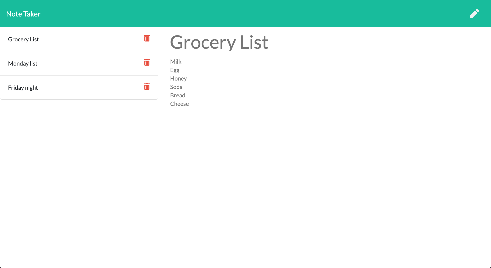

# note-taker
___
This is an application that can be use to write, save and delete notes that can help 
the user oraganize his/her thoughts and keep track of tasks that needs to be completed.

### Link of Deployed application: 

https://vast-woodland-56787.herokuapp.com/

### Technologies used in building the application

* Express.js
* Javascript
* Fs module
* Html
* Css
* Npm modules
___

